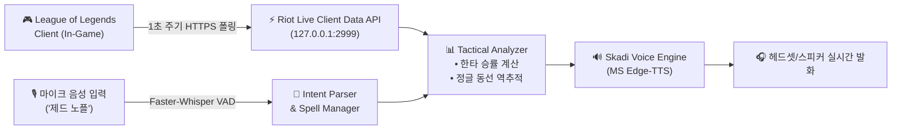

# 🏆 JARVIS / SKADI - 차세대 롤(LoL) 실시간 AI 코치 기획서 & 아키텍처

> **기획 목적:** 단순한 타이머/알람 수준(블리츠, OP.GG)을 넘어, **실제 챌린저 코치와 듀오 게임을 하는 듯한 실시간 전술 판단, 정글 동선 예측, 핸즈프리 음성 스펠 체크, 멘탈 케어**를 제공하는 고지능 롤 AI 코파일럿 시스템 설계.

---

## 🌟 5대 핵심 혁신 기능 (Core Features)

### 1. 🧠 실시간 "싸워 vs 빼" 한타 승률 판독기 (Teamfight Decision Engine)
* **개요:** 교전 발생 직전, 10명의 아이템 완성도, 레벨 차이, 주요 궁극기/스펠 유무를 실시간으로 종합 계산하여 즉각적인 교전 오더를 음성으로 지시.
* **실제 음성 콜아웃:**
  * **[유리할 때]:** `"적 원딜 방금 플래시 빠졌고 우리 바텀 2코어 떴어. 5대5 한타 걸면 80% 확률로 이겨. 지금 바로 이니시 걸어!"`
  * **[불리할 때]:** `"적 미드 코어템 나왔고 우리 정글 플래시 없어. 3번째 용 줘도 되니까 절대 모이지 말고 사이드 밀어."`

---

### 2. 🌲 상대 정글러 안개(Fog of War) 동선 역추적 예측 AI
* **개요:** 시야가 없는 암흑 속에서도 상대 정글러의 **CS 개수(정글 캠프 수)와 마지막 출현 타임스탬프**를 역산하여 갱킹 동선과 위치를 확률로 예측.
* **알고리즘 원리:**
  * 정글 1캠프당 4 CS ➔ 상대 정글 CS가 24개일 경우 6캠프 완주 확인.
  * 버프 유지 시간 및 시작 위치 역산 ➔ 3분 15초 바위게 및 3분 30초 탑/바텀 갱킹 위험 경고.
* **실제 음성 콜아웃:**
  * `"상대 리신 CS 24개인 거 보니까 정글 풀캠 돌았어. 지금 무조건 탑 갱킹 동선이야. 30초만 타워 쪽에 붙어있어."`

---

### 3. 🎙️ 핸즈프리 자연어 스펠 체크 (Voice Spell Tracker)
* **개요:** 교전 중 채팅을 칠 필요 없이 마이크로 짧게 말하면 스카디가 자동으로 300초(5분) 점멸 타이머를 등록하고 갱킹 타이밍에 리마인드.
* **인터랙션 흐름:**
  1. 유저: `"제드 노플"` 또는 `"바텀 둘 다 플 빠짐"`
  2. 스카디: `"제드 점멸 5분 타이머 등록 완료."`
  3. **4분 30초 후 스카디 자동 브리핑:** `"마스터, 제드 점멸 30초 뒤에 돌아와. 지금 정글 불러서 따자."`

---

### 4. 🎭 상황별 리얼타임 듀오 리액션 & 멘탈 케어 페르소나
* **개요:** 딱딱한 기계음이 아닌, 실제 롤을 잘 아는 든든한 듀오 파트너 페르소나 탑재.
* **실제 음성 콜아웃:**
  * **[억까 당해 데스 시]:** `"와... 상대 정글 3번 연속 갱킹 실화야? 멘탈 잡아, 저거 탑 동선 다 버린 거라 우리 바텀이 캐리해줄 거야."`
  * **[클러치 솔킬 획득 시]:** `"나이스 킬! 방금 점멸 예측 무빙 미쳤다 ㅋㅋㅋ 바로 바텀 타워 밀어버리자!"`

---

### 5. 📊 게임 종료 10초 팩트폭격 복기 & MVP 리포트
* **개요:** 넥서스가 파괴되는 즉시 10초 이내에 딜량, 킬 관여율, 시야 점수를 분석하여 핵심 승패 요인을 브리핑.
* **실제 음성 콜아웃:**
  * `"이번 판 딜량 3만 8천으로 팀 내 1등! 다만 22분 바론 앞 무리한 진입 빼고는 완벽했어. 평점 S- 드립니다."`

---

## 🛠️ 기술 아키텍처 & 데이터 파이프라인

### 1. 데이터 소스 (100% 라이엇 공인 합법 API)
* **Riot Live Client Data API (`https://127.0.0.1:2999/liveclientdata/allgamedata`)**:
  * 10인 챔피언 이름, 실시간 레벨, KDA, 골드, 인벤토리 아이템, 용/바론 젠 타이머, 스펠 쿨타임
* **Riot LCU API (League Client Update)**:
  * 픽창(Champ Select) 진입 시 상대 라이너 전적 및 룬 추천
* **Data Dragon (Riot CDN)**:
  * 160+ 챔피언 기본 스킬 쿨타임, 스킬 계수, 데미지 속성(AD/AP/고정) DB

---

## 📅 구현 로드맵 (Roadmap)

| 단계 | 모듈 및 핵심 작업 | 비고 |
|---|---|---|
| **Phase 1** | `modules/lol_live_coach.py` 기본 뼈대 • Riot Live API 1초 폴러 연동 • KDA, 용/바론 타이머, 6렙/코어템 완성 감지기 | 라이엇 로컬 API 연동 |
| **Phase 2** | 음성 스펠 체크 & 정글 동선 예측기 • `"제드 노플"` 음성 감지 ➔ 5분 타이머 ➔ 30초 전 브리핑 • CS 기반 정글 동선 역산기 | VAD + 로직 연동 |
| **Phase 3** | 한타 승률 계산기 & 듀오 리액션 페르소나 • 10인 골드/템 종합 승률 오더 • 억까/솔킬 상황별 스카디 맞춤형 대사 및 팩트폭격 복기 | LLM + Rule Hybrid |
