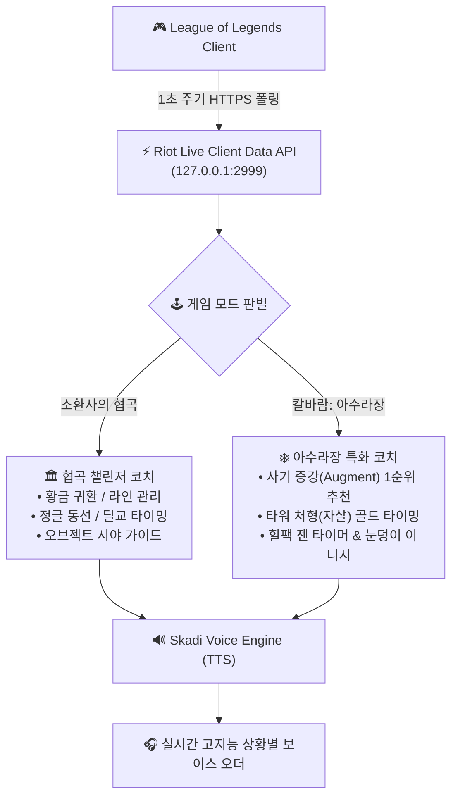

# 🏆 JARVIS / SKADI - 롤(LoL) 실시간 AI 코치 & 칼바람 나락: 아수라장 전용 기획서

> **기획 목적:** 협곡(소환사의 협곡) 랭크 게임은 물론, 최근 대세인 **'칼바람 나락: 아수라장(ARAM Mayhem / 증강 모드)'**까지 완벽하게 지원하는 **올라운드 실시간 롤 AI 코파일럿 시스템** 설계.

---

## 🏛️ PART 1. 소환사의 협곡 (Summoner's Rift) 챌린저 코칭

### 1. ⚔️ 상대 핵심 스킬 빠졌을 때 "딜교 타임" 실시간 콜 (Trading Window)
* **개요:** 상대방이 핵심 스킬(그랩, 생존기, CC기)을 허공에 날렸을 때를 포착하여 **정확한 공격 타이밍(초 단위)**을 음성으로 브리핑.
* **실제 음성 콜아웃:**
  * 🔊 `"상대 아리 매혹(E) 빗나갔어! 12초 동안 매혹 없으니까 앞으로 들어가서 강하게 딜교해!"`
  * 🔊 *(쿨타임 3초 전)* `"아리 매혹 3초 뒤에 돌아와, 뒤로 빠져!"`
  * 🔊 `"블리츠 그랩 빠졌어. 20초간 프리 딜 타이밍이야, 라인 압박해!"`

---

### 2. 🎯 한타 1순위 포커싱 타겟 & 위협 스킬 브리핑 (Target Priority)
* **개요:** 한타가 열리기 직전, 내가 **누구를 먼저 죽여야 하고 누구의 스킬을 가장 조심해야 하는지** 명확하게 짚어줍니다.
* **실제 음성 콜아웃:**
  * 🔊 `"상대팀에서 널 죽일 수 있는 스킬은 '말파이트 궁' 하나뿐이야. 말파이트 점멸 궁만 의식하고, 한타 열리면 상대 원딜(바루스)부터 먼저 포커싱해."`

---

### 3. 🔄 황금 귀환 타이밍 & 대포 웨이브 집콜 오더 (Optimal Recall Timing)
* **개요:** 언제 집(귀환)을 가야 미니언 손실이 없고 템 차이를 벌릴 수 있는지 실시간 라인 상태와 골드를 계산하여 집 타이밍을 즉시 오더.
* **실제 음성 콜아웃:**
  * 🔊 `"마스터, 1350원 모였고 다음 웨이브가 대포 미니언이야. 지금 빠르게 밀고 집 가면 미니언 손실 0개야. 지금 바로 B(귀환) 눌러!"`

---

### 4. 🌊 킬 획득 후 라인 관리 & 상대 복귀 템포 예측 (Post-Kill Wave & Tempo)
* **개요:** 상대를 솔킬 땄을 때 라인 푸시 vs 프리징을 3초 만에 판단하고 상대 부활/텔레포트 복귀 시간을 브리핑.
* **실제 음성 콜아웃:**
  * 🔊 **[밀고 가야 할 때]:** `"나이스 솔킬! 상대 텔 없어. 걸어오는 데 32초 걸리니까 원거리 미니언 스킬로 다 지우고 포탑 1칸 채굴하고 집 가자."`
  * 🔊 **[당겨야 할 때 (프리징)]:** `"스킬 쓰지 마! 이 라인은 가만히 놔두고 지금 바로 집 가면 상대 미니언 2웨이브 다 타서 상대 완전 망해. 지금 바로 귀환 타!"`

---

### 5. 🌲 상대 정글러 안개(Fog of War) 동선 역추적 예측 AI
* **개요:** 시야가 없는 암흑 속에서도 상대 정글러의 **CS 개수(정글 캠프 수)와 마지막 출현 타임스탬프**를 역산하여 갱킹 동선과 위치를 확률로 예측.
* **실제 음성 콜아웃:**
  * 🔊 `"상대 리신 CS 24개인 거 보니까 정글 풀캠 돌았어. 지금 무조건 탑 갱킹 동선이야. 30초만 타워 쪽에 붙어있어."`

---

### 6. 🧭 용/바론 1분 30초 전 "시야 와드 위치" 족집게 가이드
* **개요:** 진영(블루/레드)에 따라 **어디에 와드를 박아야 하는지** 구체적인 핑/음성 코칭.
* **실제 음성 콜아웃:**
  * 🔊 `"용 1분 30초 전이야. 우리가 블루팀이니까 상대 삼거리 부쉬랑 용 뒤편 정글 입구에 제어 와드 박아둬. 안 그러면 바텀이 잘려."`

---

### 7. 📦 실시간 상대 템트리 카운터 아이템 추천 (Adaptive Itemization)
* **실제 음성 콜아웃:**
  * 🔊 `"상대 사일러스랑 아트록스 피흡 템 나왔어. 2코어로 치감템(처형인의 대검 / 망각의 구)부터 먼저 올려."`

---

### 8. 🎙️ 핸즈프리 자연어 스펠 체크 ("제드 노플" ➔ 5분 뒤 자동 브리핑)
### 9. 🎭 멘탈 케어 & 리얼타임 듀오 리액션 (억까 위로 / 슈퍼플레이 샤라웃)
### 10. 📊 게임 종료 10초 팩트폭격 복기 & MVP 리포트

---

## ❄️ PART 2. 칼바람 나락: 아수라장 (ARAM: Mayhem) 전용 AI 코칭

> **칼바람 아수라장의 특징:** 귀환이 불가능한 5대5 단일 라인 난타전 + 아레나식 **'사기 증강(Augments)'** + 힐팩 쟁탈전 + 눈덩이(표식) 변수 극대화.

---

### 🎲 1. 사기 증강(Augments) 실시간 1순위 추천 & 시너지 트리거
* **개요:** 증강 선택창이 떴을 때, 내 챔피언 스킬셋과 가장 사기적인 시너지를 내는 **1티어 증강을 1초 만에 음성으로 추천**.
* **실제 음성 콜아웃:**
  * 🔊 **[이즈리얼 / 카이사]:** `"증강 3개 중에 '연발 사격(주문 가속)'이 압도적 1티어야. Q 쿨타임 0.5초 되니까 무조건 저거 골라!"`
  * 🔊 **[세트 / 탱커]:** `"지금 '거인화' 또는 '묵직한 일격' 골라. W 고정 딜 3000 넘게 뽑을 수 있어."`
  * 🔊 **[카타리나 / 암살자]:** `"적 CC기 많으니까 '돌진 시 무적' 증강 선택해."`

---

### 💀 2. 타워 처형(Execution) 자살 타이밍 & 골드 소모 오더
* **개요:** 칼바람은 집을 못 가므로 **"언제 상대에게 킬을 안 주고 타워에 꼴아박아 템을 사올지"**가 승패의 90%를 결정합니다.
* **판단 알고리즘:**
  * 내 소지 골드 ≥ 3000G + 라인을 상대 타워에 밀어넣음 + 적 챔피언에게 맞지 않은 지 13초 경과 ➔ **처형 각(Execute Window) 활성화**.
* **실제 음성 콜아웃:**
  * 🔊 `"마스터 지금 3400원 모였어! 상대 에이스 띄웠으니까 지금 상대 타워에 처형당해. 템 사오면 무조건 게임 터뜨려!"`
  * 🔊 `"피 100 남았는데 돈 700원밖에 없어. 지금 죽으면 템도 못 사니까 힐팩 나올 때까지 뒤에서 스킬만 날려."`

---

### 🍓 3. 힐팩(Health Relic) 10초 전 리젠 타이머 & 스틸 오더
* **개요:** 힐팩 생성 시간을 카운트다운하여 내가 먹을지, 눈덩이로 상대 힐팩을 스틸할지 오더.
* **실제 음성 콜아웃:**
  * 🔊 `"우리 쪽 힐팩 10초 뒤에 젠돼. 마나 없으니까 뒤로 빠져서 먹어."`
  * 🔊 `"상대 힐팩 떴다! 상대 딸피니까 눈덩이 던져서 힐팩 스틸하고 킬 따자!"`

---

### ❄️ 4. 눈덩이(표식/Snowball) 이니시 & 역이니시 경고
* **개요:** 적 주요 딜러에게 눈덩이가 맞았을 때 진입 각을 보거나, 반대로 적 이니시에이터의 눈덩이 진입을 경고.
* **실제 음성 콜아웃:**
  * 🔊 **[아군 눈덩이 적중]:** `"상대 바루스한테 눈덩이 맞았어! 진입하면 확정 킬이야, 날아가!"`
  * 🔊 **[적 눈덩이 경고]:** `"상대 말파이트가 우리 미니언에 눈덩이 탔어! 궁 퍼지기 전에 양옆으로 산개해!"`

---

### ⚡ 5. 칼바람 5대5 난타전 실시간 스킬 피하기 & 포커싱 가이드
* **개요:** 10명이 스킬을 마구 쏟아붓는 난전 속에서 내가 피해야 할 1순위 스킬과 쳐야 할 적을 정리.
* **실제 음성 콜아웃:**
  * 🔊 `"적 블리츠 그랩만 보고 피해! 앞라인 치지 말고 눈덩이로 적 럭스 먼저 물어!"`

---

## 🛠️ 통합 기술 아키텍처 (협곡 + 칼바람 아수라장)

---

## 📅 구현 로드맵 (Roadmap)

| 단계 | 협곡 기능 | 칼바람 아수라장 기능 |
|---|---|---|
| **Phase 1** | • 황금 귀환(Recall) 오더 • 딜교 타임(상대 스킬 빠짐) 콜 | • 사기 증강(Augment) 실시간 추천 • 타워 처형(자살) 골드 타이밍 콜 |
| **Phase 2** | • 솔킬 후 라인 푸시 vs 프리징 판독 • 음성 스펠 체크 ("제드 노플") | • 힐팩 젠 10초 전 타이머 • 눈덩이 진입/산개 판독기 |
| **Phase 3** | • 정글 동선 역추적 & 팩트폭격 복기 | • 난타전 포커싱 네비게이션 & 듀오 리액션 |
