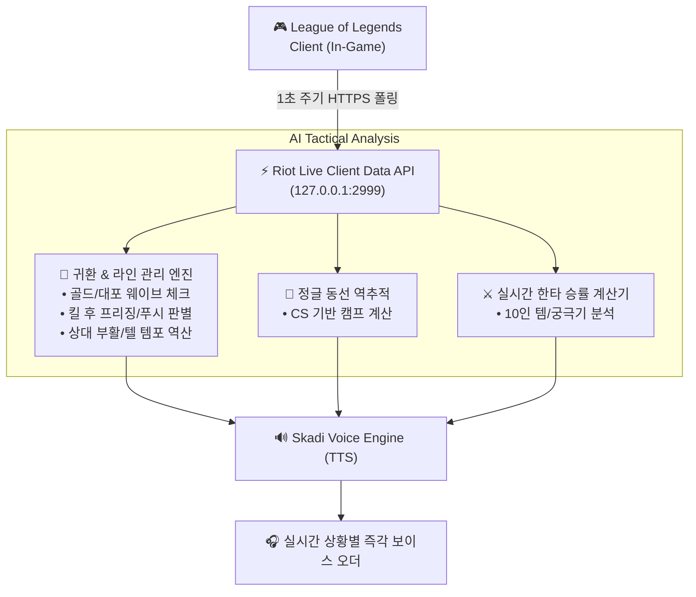

# 🏆 JARVIS / SKADI - 차세대 롤(LoL) 실시간 AI 코치 기획서 & 아키텍처

> **기획 목적:** 단순한 타이머/알람 수준(블리츠, OP.GG)을 넘어, **실제 챌린저 코치와 듀오 게임을 하는 듯한 실시간 전술 판단, 라인전 귀환/복귀 템포 오더, 정글 동선 예측, 핸즈프리 음성 스펠 체크, 멘탈 케어**를 제공하는 고지능 롤 AI 코파일럿 시스템 설계.

---

## 🌟 7대 핵심 혁신 기능 (Core Features)

### 1. 🔄 황금 귀환 타이밍 & 대포 웨이브 집콜 오더 (Optimal Recall Timing Engine)
* **개요:** 언제 집(귀환)을 가야 미니언 손실이 없고 템 차이를 벌릴 수 있는지 실시간 라인 상태와 골드를 계산하여 집 타이밍을 즉시 오더.
* **판단 알고리즘:**
  * **골드 달성 체크:** 핵심 코어 하위템(BF대검 1300G, 양장본 1200G, 톱날 1000G, 절정 1300G 등) 달성 즉시 감지.
  * **대포 미니언 웨이브(Cannon Wave) 타이밍 계산:** 대포 웨이브는 타워를 오래 버티므로, 대포 웨이브 직전 라인을 밀고 집을 가면 **미니언 손실 0개(완벽한 템포 귀환)** 달성.
* **실제 음성 콜아웃:**
  * 🔊 `"마스터, 지금 1350원 모였고 다음 웨이브가 대포 미니언이야. 지금 빠르게 밀고 집 가면 미니언 하나도 안 놓쳐. 지금 바로 B(귀환) 눌러!"`
  * 🔊 `"상대 정글 봇 쪽에 보였고 템 살 돈 애매해. 지금 집 가지 말고 한 웨이브 더 먹고 가자."`

---

### 2. 🌊 킬 획득 후 라인 관리 & 상대 복귀 템포 예측 (Post-Kill Wave Control & Tempo Predictor)
* **개요:** 상대를 솔킬 땄을 때 **'라인을 밀어야 할지 vs 당겨놓고 집 가야 할지'**를 3초 만에 판단하고, 상대의 부활 시간과 이동 속도/텔레포트 유무를 계산하여 복귀 시점을 브리핑.
* **판단 알고리즘:**
  * **케이스 A (밀어야 할 때):** 미니언이 상대 타워 근처에 걸치거나 내 미니언이 많을 때 ➔ 상대 타워에 완전히 박아넣어 상대 CS를 전부 태워버림.
  * **케이스 B (당겨야 할 때 - 프리징):** 상대 원거리 미니언 3~4마리가 살아있고 아군 미니언이 적을 때 ➔ 라인 안 건드리고 즉시 집 가면 슬로우 푸시로 상대 미니언이 타서 상대가 경험치/골드 대손해.
  * **상대 텔레포트 / 부활 템포 계산:**
    * 상대 텔레포트 On ➔ 8초 만에 라인 복귀 가능.
    * 상대 텔레포트 Off ➔ 부활 시간(15s) + 본진에서 라인까지 도보(18s) = **총 33초의 자유 시간(채굴/로밍) 확보**.
* **실제 음성 콜아웃:**
  * 🔊 **[밀고 가야 할 때]:** `"나이스 솔킬! 상대 텔레포트 없어. 걸어오는 데 32초 걸리니까 원거리 미니언 스킬로 다 지우고 포탑 1칸 채굴하고 집 가자."`
  * 🔊 **[당겨야 할 때 (라인 프리징)]:** `"스킬 쓰지 마! 이 라인은 가만히 놔두고 지금 바로 집 가면 상대 미니언 2웨이브 다 타서 상대 완전 망해. 지금 바로 귀환 타!"`
  * 🔊 **[상대 텔 복귀 경고]:** `"상대 텔레포트 있어! 피 200으로 포탑 채굴 욕심내다 텔 탄 상대한테 역관광 당해. 채굴하지 말고 지금 당장 빠져!"`

---

### 3. 🧠 실시간 "싸워 vs 빼" 한타 승률 판독기 (Teamfight Decision Engine)
* **개요:** 교전 발생 직전, 10명의 아이템 완성도, 레벨 차이, 주요 궁극기/스펠 유무를 실시간으로 종합 계산하여 즉각적인 교전 오더를 음성으로 지시.
* **실제 음성 콜아웃:**
  * **[유리할 때]:** `"적 원딜 방금 플래시 빠졌고 우리 바텀 2코어 떴어. 5대5 한타 걸면 80% 확률로 이겨. 지금 바로 이니시 걸어!"`
  * **[불리할 때]:** `"적 미드 코어템 나왔고 우리 정글 플래시 없어. 3번째 용 줘도 되니까 절대 모이지 말고 사이드 밀어."`

---

### 4. 🌲 상대 정글러 안개(Fog of War) 동선 역추적 예측 AI
* **개요:** 시야가 없는 암흑 속에서도 상대 정글러의 **CS 개수(정글 캠프 수)와 마지막 출현 타임스탬프**를 역산하여 갱킹 동선과 위치를 확률로 예측.
* **알고리즘 원리:**
  * 정글 1캠프당 4 CS ➔ 상대 정글 CS가 24개일 경우 6캠프 완주 확인.
  * 버프 유지 시간 및 시작 위치 역산 ➔ 3분 15초 바위게 및 3분 30초 탑/바텀 갱킹 위험 경고.
* **실제 음성 콜아웃:**
  * 🔊 `"상대 리신 CS 24개인 거 보니까 정글 풀캠 돌았어. 지금 무조건 탑 갱킹 동선이야. 30초만 타워 쪽에 붙어있어."`

---

### 5. 🎙️ 핸즈프리 자연어 스펠 체크 (Voice Spell Tracker)
* **개요:** 교전 중 채팅을 칠 필요 없이 마이크로 짧게 말하면 스카디가 자동으로 300초(5분) 점멸 타이머를 등록하고 갱킹 타이밍에 리마인드.
* **인터랙션 흐름:**
  1. 유저: `"제드 노플"` 또는 `"바텀 둘 다 플 빠짐"`
  2. 스카디: `"제드 점멸 5분 타이머 등록 완료."`
  3. **4분 30초 후 스카디 자동 브리핑:** `"마스터, 제드 점멸 30초 뒤에 돌아와. 지금 정글 불러서 따자."`

---

### 6. 🎭 상황별 리얼타임 듀오 리액션 & 멘탈 케어 페르소나
* **개요:** 딱딱한 기계음이 아닌, 실제 롤을 잘 아는 든든한 듀오 파트너 페르소나 탑재.
* **실제 음성 콜아웃:**
  * **[억까 당해 데스 시]:** `"와... 상대 정글 3번 연속 갱킹 실화야? 멘탈 잡아, 저거 탑 동선 다 버린 거라 우리 바텀이 캐리해줄 거야."`
  * **[클러치 솔킬 획득 시]:** `"나이스 킬! 방금 점멸 예측 무빙 미쳤다 ㅋㅋㅋ 바로 바텀 타워 밀어버리자!"`

---

### 7. 📊 게임 종료 10초 팩트폭격 복기 & MVP 리포트
* **개요:** 넥서스가 파괴되는 즉시 10초 이내에 딜량, 킬 관여율, 시야 점수를 분석하여 핵심 승패 요인을 브리핑.
* **실제 음성 콜아웃:**
  * 🔊 `"이번 판 딜량 3만 8천으로 팀 내 1등! 다만 22분 바론 앞 무리한 진입 빼고는 완벽했어. 평점 S- 드립니다."`

---

## 🛠️ 기술 아키텍처 & 데이터 파이프라인

---

## 📅 구현 로드맵 (Roadmap)

| 단계 | 핵심 모듈 및 작업 내용 | 비고 |
|---|---|---|
| **Phase 1** | `modules/lol_live_coach.py` 기본 뼈대 • Riot Live API 1초 폴러 연동 • 골드 및 대포 웨이브 계산 기반 **황금 귀환(Recall) 오더** • 킬/데스 이벤트 및 6렙/코어템 완성 감지기 | 실시간 라이브 연동 |
| **Phase 2** | 라인 관리 & 템포 예측기 + 음성 스펠 체크 • 솔킬 획득 시 라인 푸시 vs 프리징 실시간 오더 • 상대 텔레포트/부활 복귀 타이머 계산 브리핑 • `"제드 노플"` 음성 감지 ➔ 5분 타이머 ➔ 30초 전 브리핑 | VAD + 로직 연동 |
| **Phase 3** | 정글 동선 역추적 & 듀오 리액션 페르소나 • CS 기반 상대 정글 위치 예측 • 억까/솔킬 상황별 스카디 맞춤형 대사 및 게임 종료 10초 팩트폭격 복기 | Full Experience |
