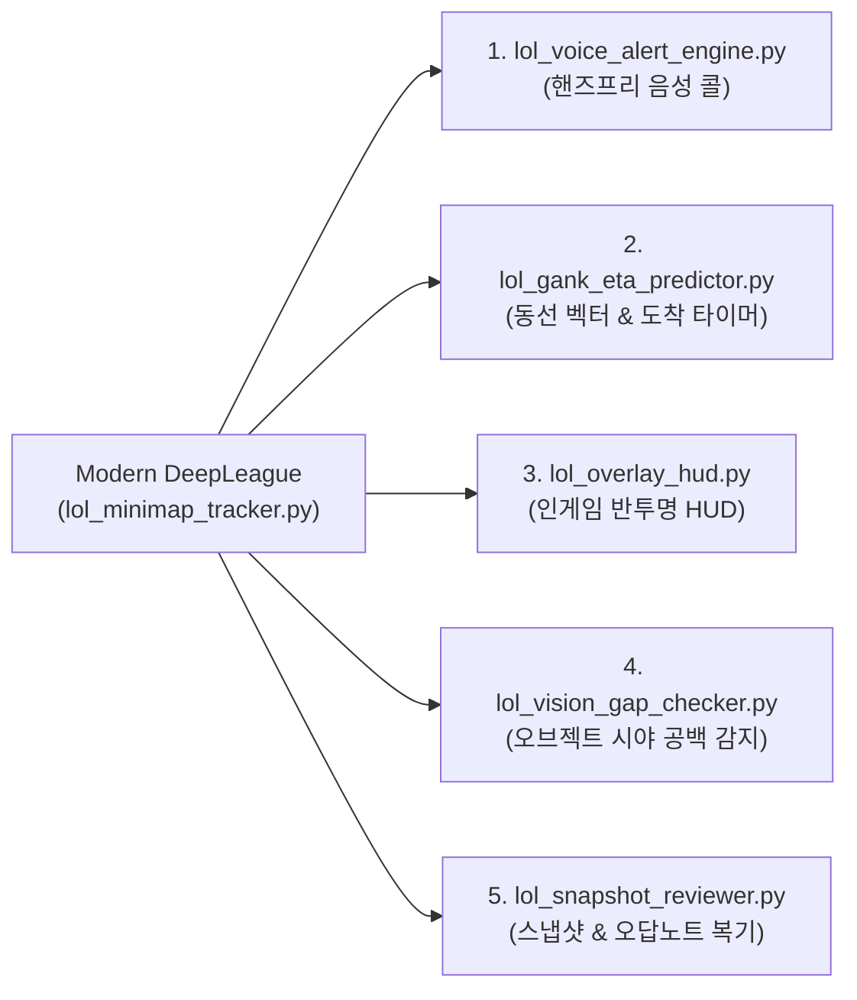

# 🎮 Modern DeepLeague: 실시간 롤(LoL) 미니맵 전술 레이더 데스크탑 사용자 가이드

> **소환사의 협곡 실시간 비전 조기경보 및 챔피언 트래킹 시스템**  
> *GPU 점유율 0.0% · 2~3ms 초저지연 연산 · 240+ FPS 방어 · 스카디 AI 실시간 음성 브리핑*

---

## 📌 목차
1. [개요 및 특징](#1-개요-및-특징)
2. [데스크탑 환경 권장 설정](#2-데스크탑-환경-권장-설정)
3. [실행 방법](#3-실행-방법)
4. [관리자 대시보드 (HUD) 사용법](#4-관리자-대시보드-hud-사용법)
5. [롤 인게임 실전 테스트 절차 (Step-by-Step)](#5-롤-인게임-실전-테스트-절차-step-by-step)
6. [전술 조기경보 4대 엔진 안내](#6-전술-조기경보-4대-엔진-안내)
7. [QHD / 4K 모니터 및 맞춤 해상도 캘리브레이션](#7-qhd--4k-모니터-및-맞춤-해상도-캘리브레이션)
8. [자주 묻는 질문 및 문제 해결 (FAQ)](#8-자주-묻는-질문-및-문제-해결-faq)

---

## 1. 개요 및 특징

과거 2018년의 원작 DeepLeague는 무거운 TensorFlow CNN 딥러닝 모델로 인해 인게임 프레임 드랍(FPS 저하)과 GPU 부하(30~40%)를 발생시켰습니다.

**Modern DeepLeague**는 이를 완전히 혁신하여 최신 기술로 재설계되었습니다:
- **0.3ms 다이렉트 메모리 캡처**: Windows GDI/DirectX 버퍼에서 `mss` 라이브러리를 통해 캡처 지연을 극소화했습니다.
- **순수 CPU 초경량 벡터 연산**: NumPy 벡터화 링 마스크와 거리 기반 클러스터링으로 **GPU 부하 0.0%**를 달성하여 롤 인게임 240+ FPS를 완벽히 방어합니다.
- **인게임 듀얼 레이어 시너지**:
  - `routers/lol.py`: LCU API 기반의 골드 격차, KDA, 스펠 쿨타임, 아이템 수치 데이터 제공.
  - `modules/lol_minimap_tracker.py`: 미니맵 비전 기반의 적군 위치, 다이브, 로밍, 오브젝트 버스트 실시간 시각 경보 제공.
- **스카디 AI 음성 브리핑 연동**: 위험 감지 시 즉시 스카디 음성(TTS)으로 인게임 콜을 전달합니다.

---

## 2. 데스크탑 환경 권장 설정

실시간 미니맵 캡처가 가장 매끄럽게 동작하도록 게임 내 설정을 확인해 주세요.

1. **디스플레이 모드**: 
   - **"테두리 없는 창 모드"** (권장) 또는 "창 모드"
   - *(전체 화면 모드에서도 캡처되나, 테두리 없는 창 모드가 듀얼 모니터 관측 및 오버레이 확인에 가장 적합합니다)*
2. **해상도**:
   - 기본 설정: **FHD (1920 x 1080)** 기준 (미니맵 크기 100, 우측 하단 290x290px)
   - *QHD(2560x1440) 또는 4K(3840x2160) 모니터의 경우 시스템이 기본 해상도를 자동 감지하여 스케일링을 자동 보정합니다.*
3. **인게임 인터페이스**:
   - 미니맵 위치: **화면 우측 하단** (기본값)
   - 미니맵 크기: **100** (기본 권장)

---

## 3. 실행 방법

### 방법 A: JARVIS 메인 서버와 함께 전체 실행 (권장)
바탕화면의 바로가기 또는 프로젝트 폴더의 배치 파일이나 명령어를 실행합니다.

```bash
# 콘솔 터미널 실행
python brain_server.py

# 또는 배치 파일 실행
서버_켜기.bat
```
- 서버가 켜지면 메인 포털, 챗봇, 음성 합성(TTS), 그리고 미니맵 전술 트래커가 일괄 가동됩니다.
- 접속 URL: `http://localhost:8000/admin`

---

### 방법 B: 미니맵 트래커 단독 독립 실행 (테스트용)
메인 백엔드 없이 미니맵 트래커 및 대시보드 기능만 가볍게 단독으로 띄워 테스트할 때 사용합니다.

```bash
python modules/jarvis_extension_router.py
```
- 접속 URL: `http://localhost:8000/admin`
- Swagger 문서: `http://localhost:8000/docs`

---

## 4. 관리자 대시보드 (HUD) 사용법

웹 브라우저(크롬, 엣지 등)를 열고 `http://localhost:8000/admin`에 접속합니다.

1. **Modern DeepLeague 미니맵 전술 레이더 카드**:
   - **레이더 활성화 (초록색 버튼)**: 백그라운드 캡처 스레드를 가동합니다 (초당 4회 감시).
   - **레이더 정지 (빨간색 버튼)**: 감시를 일시 중지합니다.
   - **1회 즉시 스캔 (파란색 버튼)**: 현재 화면에서 즉시 1프레임을 찍어 적/아군 탐지 좌표를 테스트합니다.
2. **실시간 뷰포트 (Viewport Preview)**:
   - 현재 캡처 중인 미니맵 화면이 실시간으로 갱신됩니다.
   - 적 챔피언은 **빨간색 원형 타깃**, 아군은 **네온 시안색 타깃**으로 오버레이 표시됩니다.
3. **실시간 감지 통계**:
   - **적군/아군 감지 수**: 미니맵 내에 확인된 챔피언 수 (0~5명).
   - **협곡 구역별 현황**: 챔피언이 위치한 구역(탑, 미드, 바텀, 용 둥지, 강가 등) 실시간 출력.
   - **전술 경고 로그**: 최근 발생한 위험 알림이 타임스탬프와 함께 최신순으로 표시됩니다.

---

## 5. 롤 인게임 실전 테스트 절차 (Step-by-Step)

안전하게 기능 동작을 확인하기 위해 **연습 모드(Practice Tool)**에서 3분 만에 테스트하는 방법입니다.

### [Step 1] 백엔드 가동 및 대시보드 켜기
1. `python brain_server.py` 실행
2. 브라우저에서 `http://localhost:8000/admin` 열기
3. `[레이더 활성화]` 버튼 클릭 (배지: `🟢 감시 가동 중`)

### [Step 2] 롤 연습 모드 생성
1. 롤 클라이언트 실행 -> **플레이** -> **연습** -> **훈련 모드**
2. **봇 추가**: 적 봇(예: 소라카, 아무무 등)을 1~2명 추가하고 게임 시작 클릭.
3. 게임 로딩 후 소환사의 협곡 입장.

### [Step 3] 실시간 감지 확인
1. 게임 시작 후 미니맵 우하단을 보면 아군 챔피언(본인) 아이콘이 보입니다.
2. 대시보드의 미니맵 뷰포트에 내 미니맵이 그대로 캡처되는지 확인합니다.
3. 아군(Ally) 카운트가 `1` 이상으로 잡히는지 확인합니다.

### [Step 4] 전술 경고 발생 테스트
1. **로밍/기습 테스트**:
   - 미드 라인으로 이동하여 미니맵 강가(River) 쪽으로 봇 챔피언을 유인하거나 시야에 닿게 합니다.
   - `⚠️ [상단/하단 강가] 적 챔피언 기습/로밍 이동 중!` 경고가 발생하는지 확인합니다.
2. **용 둥지 집결 테스트**:
   - 연습 모드 툴을 사용하여 용을 소환하거나, 적 봇들을 용 둥지 주변에 배치합니다.
   - 적 2명이 용 둥지 구역 안에 들어오면 `🐉 상대 2명 용 둥지 집결 포착! 스틸 준비 또는 라인 압박 권장!` 알림이 발생합니다.
3. **타워 다이브 위험 테스트**:
   - 적 봇이 아군 타워 쪽으로 3명 이상 몰릴 때 `🚨 [라인] 적 다이브 위협 감지!` 알림이 발생합니다.

---

## 6. 전술 조기경보 4대 엔진 안내

| 경고 유형 | 심각도 | 감지 조건 | AI 추천 전술 가이드 |
| :--- | :---: | :--- | :--- |
| **OBJECTIVE_BURST** | **HIGH** | 용 둥지(Dragon Pit)에 적군 2명 이상 출현 | 즉시 시야 와드 확인, 용 스틸 준비 또는 반대 라인(탑/전령) 강한 압박 |
| **BARON_BURST** | **CRITICAL** | 바론 둥지(Baron Pit)에 적군 2명 이상 출현 | 즉시 바론 버스트 저지 및 5:5 한타 진형 형성 권고 |
| **DIVE_WARNING** | **CRITICAL** | 탑/미드/바텀 라인에 적군 3명 이상 급습 | 아군 타워를 과감히 버리고 후퇴 권장 (생존 최우선) |
| **ROAM_SPOTTED** | **MEDIUM** | 상단/하단 강가(River) 구역을 통과하는 적 포착 | 라이너 갱킹 주의 경보 및 백핑 권고 |

---

## 7. 해상도 원클릭 프리셋 및 캘리브레이션

Modern DeepLeague는 데스크탑의 주 모니터 해상도를 시작 시 자동 감지할 뿐만 아니라, **FHD, QHD, 4K, 울트라와이드 21:9 등 6대 프리셋**을 기본 탑재하여 클릭 한 번으로 즉각 전환할 수 있습니다.

### 🖥️ 지원하는 해상도 프리셋 목록

| 프리셋 키 | 규격 명칭 | 화면 해상도 | 미니맵 크기 | 캡처 영역 (ROI X / Y) | 추천 디스플레이 환경 |
| :---: | :--- | :---: | :---: | :---: | :--- |
| **`FHD`** | **FHD (1080p)** | `1920 x 1080` (16:9) | `290 px` | `1630` / `790` | 표준 24~27인치 1080p 게이밍 모니터 (기본값) |
| **`QHD`** | **QHD (1440p / 2K)** | `2560 x 1440` (16:9) | `387 px` | `2173` / `1053` | 27~32인치 144Hz+ 2K 게이밍 모니터 |
| **`4K`** | **4K UHD (2160p)** | `3840 x 2160` (16:9) | `580 px` | `3260` / `1580` | 초고화질 32~43인치 4K UHD 프리미엄 모니터 |
| **`WQHD`** | **WQHD 울트라와이드** | `3440 x 1440` (21:9) | `387 px` | `3053` / `1053` | 34인치 커브드 시네마틱 울트라와이드 모니터 |
| **`WFHD`** | **WFHD 와이드** | `2560 x 1080` (21:9) | `290 px` | `2270` / `790` | 29~30인치 21:9 가성비 와이드 모니터 |
| **`HD+`** | **노트북 HD+** | `1600 x 900` (16:9) | `242 px` | `1358` / `658` | 게이밍 랩탑 및 콤팩트 보조 모니터 |

### 🚀 프리셋 적용 방법

1. **대시보드 UI에서 원클릭 적용**:
   - `http://localhost:8000/admin` 접속 후 미니맵 레이더 카드 하단의 **[해상도 프리셋]** 버튼(`FHD`, `QHD`, `4K` 등)을 누르면 실시간으로 감시 영역이 즉시 변경됩니다.
2. **REST API 호출**:
   - `POST /api/lol/minimap/apply-preset?preset_name=QHD` 호출 시 즉시 캘리브레이션이 완료됩니다.
3. **수동 미세 조정 (커스텀)**:
   - 인게임 미니맵 크기를 100이 아닌 다른 비율로 줄이거나 늘린 경우, `POST /api/lol/minimap/calibrate`를 통해 원하는 미니맵 픽셀 크기와 좌상단 X, Y 좌표를 직접 주입할 수 있습니다.

---

## 8. 미래형 5대 확장 전술 모듈 상세 안내

Modern DeepLeague 엔진과 완벽하게 유기적으로 연동되는 **차세대 5대 전술 모듈**이 독립된 마이크로 모듈 구조로 구현되어 있습니다.



### 1) 🎧 스카디 인게임 음성 콜 엔진 (`modules/lol_voice_alert_engine.py`)
- **역할**: 대시보드를 쳐다보지 않아도, 전술 위험 발생 시 백엔드 워커 스레드가 비동기로 스카디 AI 음성(Edge-TTS / GPT-SoVITS)을 헤드셋으로 즉시 발화합니다.
- **특징**: 우선순위 기반 쿨타임(10~20초)과 최소 발화 간격을 두어 인게임 오디오가 시끄럽지 않게 정밀 조율됩니다.
- **주요 엔드포인트**: `POST /api/lol/voice/toggle`, `POST /api/lol/voice/test`

### 2) ⏳ 적 동선 벡터 예측 & 갱킹 도착 타이머 (`modules/lol_gank_eta_predictor.py`)
- **역할**: 미니맵 상에서 이동하는 적 챔피언의 2D 이동 속도 벡터($v_x, v_y$)를 계산하여, 탑/미드/바텀을 향한 갱킹 경로인지 판별하고 **예상 도착 시간(ETA, 초)**을 카운트다운합니다.
- **알림 예시**: `"🚨 [상단 강가]에서 [미드 라인] 방향 급습 감지! (도착 예상: 약 7초)"`
- **주요 엔드포인트**: `GET /api/lol/eta/active`, `POST /api/lol/eta/simulate`

### 3) 🖥️ 인게임 반투명 플로팅 오버레이 HUD (`modules/lol_overlay_hud.py`)
- **역할**: 싱글 모니터 환경에서도 롤 화면 구석에 띄워둘 수 있는 미래형 사이버틱 반투명 오버레이 HUD를 제공합니다.
- **접속 URL**: **`http://localhost:8000/overlay`**
- **특징**: 브라우저 창, OBS 브라우저 소스, PIP 또는 엣지 앱 모드로 띄울 수 있으며, 실시간 미니맵 레이더, 적군/아군 수, 갱킹 카운트다운 바가 0.25초 주기로 갱신됩니다.
- **원클릭 실행**: `POST /api/lol/overlay/launch` 호출 시 Windows 테두리 없는 미니 팝업창 자동 실행.

### 4) 🐉 오브젝트 1분 전 시야 공백 선제 감지기 (`modules/lol_vision_gap_checker.py`)
- **역할**: 드래곤 및 내셔 남작(바론) 리젠 60초 전, 미니맵 둥지 관심영역의 픽셀 휘도(Luminance)를 분석해 전장 안개(Fog of War) 상태인지 자동 판정합니다.
- **선제 경고**: 용 젠 45초 전인데 둥지가 깜깜할 경우: `"🐉 드래곤 출현 45초 전인데 용 둥지 시야가 비어있어요! 와드 설치 권장!"` 선제 브리핑.
- **주요 엔드포인트**: `GET /api/lol/vision/status`, `POST /api/lol/vision/test-alert`

### 5) 📸 전술 스냅샷 & 협곡 오답노트 복기 엔진 (`modules/lol_snapshot_reviewer.py`)
- **역할**: 다이브 위협, 용/바론 버스트 등 치명적 상황 발생 시 그 순간의 미니맵 영상을 `memory/lol_matches/{YYYY-MM-DD}/` 폴더에 즉시 자동 저장합니다.
- **야간 수면학습 연동**: 자율 학습 주기(`dream_engine_lol.py`)와 연계되어 경기 종료 후 옵시디언 다이어리에 **"스카디의 소환사의 협곡 전술 오답노트"** Markdown 보고서를 자동 편찬합니다.
- **주요 엔드포인트**: `GET /api/lol/review/latest`, `POST /api/lol/review/generate-report`

---

## 9. 자주 묻는 질문 및 문제 해결 (FAQ)

### Q1. 인게임 프레임(FPS)이 떨어지거나 렉이 걸리지 않나요?
> **전혀 영향이 없습니다.**  
> Modern DeepLeague 및 5대 전술 모듈 전체는 GPU를 0% 사용하며, 순수 초경량 CPU 비동기 스레드에서 0.3~2ms 안에 처리됩니다. 240Hz, 360Hz 초고주사율 게이밍 환경에서도 완벽한 프레임을 방어합니다.

### Q2. 화면 캡처가 검은색으로 나오거나 아무것도 안 잡혀요.
> 1. 롤 비디오 설정이 **"전체 화면"**일 경우 일부 윈도우 그래픽 드라이버 환경에서 캡처가 지연될 수 있습니다. **"테두리 없는 창 모드"**로 변경해 주세요.
> 2. 전체 화면 모드를 유지하고 싶으시다면 윈도우 그래픽 설정에서 게임 모드를 활성화해 주시면 정상 캡처됩니다.

### Q3. 스카디 음성 알림이 안 들려요.
> 1. `brain_server.py` 콘솔에서 `Edge-TTS` 또는 `GPT-SoVITS`가 정상 가동 중인지 확인합니다.
> 2. 윈도우 기본 사운드 출력 장치가 헤드셋이나 스피커로 올바르게 설정되어 있는지 확인합니다.
> 3. `POST /api/lol/voice/test` 호출을 통해 스피커 출력을 직접 테스트해 볼 수 있습니다.

---
*© 2026 JARVIS / SKADI Intelligent Tactical Assistance System. All rights reserved.*
